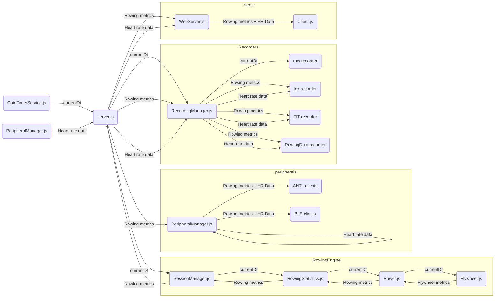
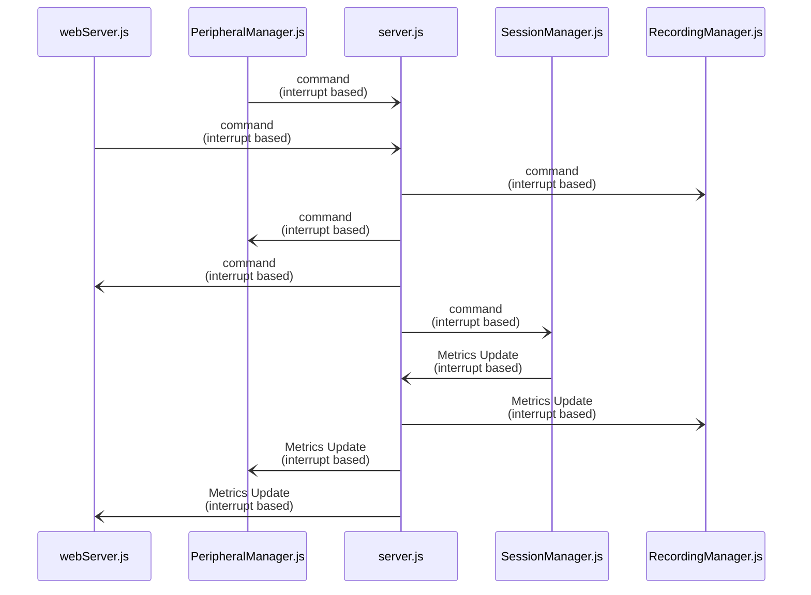
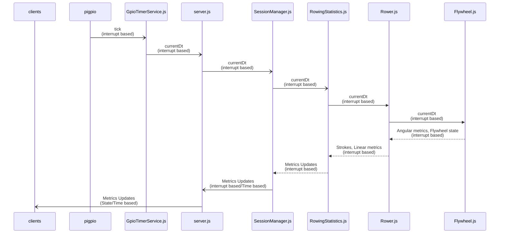
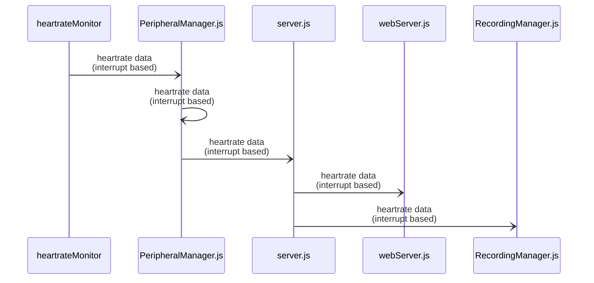
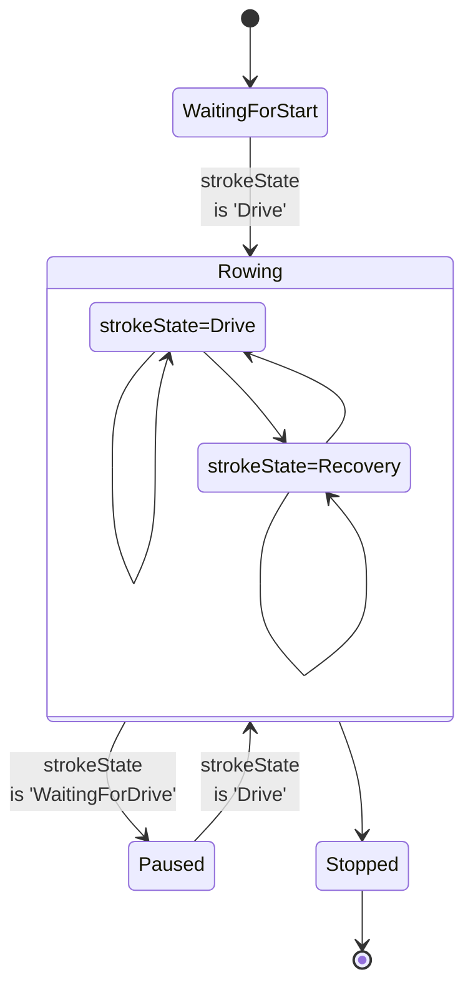
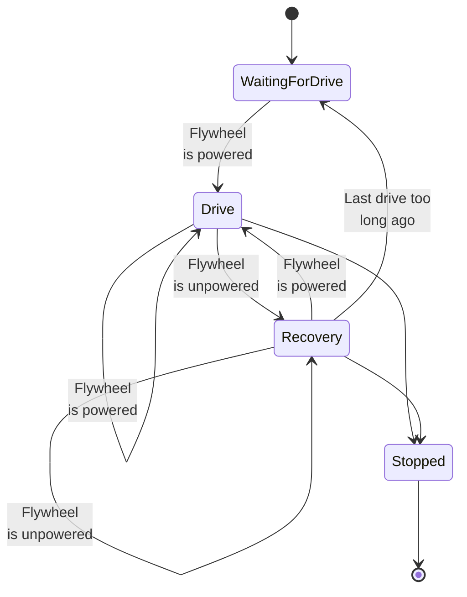

# OpenRowingMonitor architecture

<!-- markdownlint-disable no-inline-html -->
In this document, we describe the architectual construction of OpenRowingMonitor. For the reasons behind the physics, please look at [the Physics behind OpenRowingMonitor](Physics_Of_OpenRowingMonitor.md). In this document we describe the main functional blocks in OpenRowingMonitor, and the major design decissions.

## Platform choice

We have chosen for Raspberry Pi, instead of Arduino, due to the CPU requirements needed for some machines. The Raspberry Pi can easily be bought by regular users and installation of the OS and applications is pretty straightforward. It also allows for easy connection of hardware through the GPIO interface.

We have chosen to use Raspian as OS, as it is easily installed by the user, it provides a well maintained platform with many extensions, and it maintains a 64Bit PREEMPT kernel by default. [Ubuntu Core](https://ubuntu.com/core) provides a a leaner 64-bit low-latency kernel and their Snap-based IoT platform is beautiful, but it also requires a much more complex development and deployment toolchain, which would distract from the core application at the moment.

## Choice for Node.js and JavaScript

The choice has been made to use JavaScript to build te application, as many of the needed components (like GPIO and Bluetooth Low Energy) components are readily available. The choice for a runtime interpreted language is traditionally at odds with the low latency requirements that is close to physical hardware. The performance of the app depends heavily on the performance of node.js, which itself isn't optimized for low-latency and high frequency environments. However, in practice, we haven't run into any situations where CPU-load has proven to be too much or processing has been frustrated by latency, even when using full Theil-Senn quadratic regression models on larger flanks (which is O(n2)).

## Main functional components and flow between them

OpenRowingMonitor consists out of several isolated functional blocks, some even being their own thread, all communicating through `server.js`. Each functional block has its own manager, maging the entire functional block. In describing OpenRowingMonitor's main architecture, we distinguish between the dataflow and the controleflow. The latter typically is handled by the manager of the section.

We first describe the main data flows. Next, relation between these main functional components by describing the flow of the key pieces of information in more detail: the flywheel and heartrate measurements, as well as the command structure.

### Introduction: main data flow

At the highest level, we recognise the following functional components, with their primary dataflows:

Here, *currentDt* stands for the time between the impulses of the sensor, as measured by the pigpio in 'ticks' (i.e. microseconds sinds OS start). The `GpioTimerService.js` is a small functional block that feeds the rest of the application.

Key element is that consuming functional blocks (clients) always will filter for themselves: the RowingEngine essentially transforms *currentDt*'s into useable rowing metrics, and attach flags onto them in the `metricsContext` object contained in the metrics. This context allows clients to act upon states that are specifically relevant to them (like the start of the drive, the start of a session, etc.), while ignoring updates that are irrelevant for them.

### Command flow

All functional blocks have a 'manager', which expose a `handleCommand()` function, which respond to a defined set of commands. These commands are explicitly restricted to user actions (i.e. inputs via the web-interface or a peripheral). In essence, this is a user of external session control (via Bluetooth or ANT+) dictating behaviour of OpenRowingMonitor as an external trigger. Effects of metrics upon a session-state (i.e. session start or end based on a predefined session end) should be handled via the metrics updates. Adittionally, effects upon a session state as a result of a command (i.e. session ends because of a command) should also be handled via the metrics updates whenever possible. These manual commands are connected as follows:

Both the `webServer.js` and `PeripheralManager.js` can trigger a command. Server.js will communicate this command to all managers, where they will handle this as they see fit. Several commands are defined:

| command | description |
|---|---|
| requestControl | A peripheral has requested control of the connection (currently nothing happens internally in ORM with this). This command is routinely sent at the start of a ANT+ FE-C communication. |
| updateIntervalSettings | An update in the interval settings has to be processed |
| start | start of a session initiated by the user. As the true start of a session is actually triggered by the flywheel, which will always be communicated via the metrics, its only purpose is to make sure that the flywheel is allowed to move. This command is routinely sent at the start of a ANT+ FE-C communication. |
| startOrResume | User forced (re)start of a session. As the true start of a session is actually triggered by the flywheel, which will always be communicated via the metrics, its only purpose is to clear the flywheel for further movement. This is not used in normal operation, but can functionally change a 'stopped' session into a 'paused' one. Intended use is to allow a user to continue beyond pre-programmed interval parameters as reaching them results in a session being 'stopped'. |
| pause | User/device forced pause of a session (pause of a session triggered from the flywheel will always be triggered via the metrics) |
| stop | User/device forced stop of a session (stop of a session triggered from the flywheel will always be triggered via the metrics) |
| reset | User/device has reset the session |
| switchBlePeripheralMode | User has selected another BLE device from the GUI, the peripheralmanager needs to effectuate this |
| switchAntPeripheralMode | User has selected another ANT+ device from the GUI, the peripheralmanager needs to effectuate this |
| switchHrmMode | User has selected another heartrate device |
| refreshPeripheralConfig | A change in heartrate, BLE or ANT+ device has been triggered (this triggers a refresh of the current config from the GUI) |
| uploadTraining | A request is made to upload a training to Strava |
| stravaAuthorizationCode | An authorization code is provided to upload a training to Strava |
| shutdown | A shutdown is requested, also used when a part of the application crashes or the application recieves a 'SIGINT' |

Please note, to guarantee a decent closure of data, a 'stop' command from the user will be ignored by `RecordingManager.js` and `PeripheralManager.js`, as the `SessionManager.js` will respond with a new set of metrics, with the 'isSessionStop' flag embedded. On a 'shutdown' command, `RecordingManager.js` and `PeripheralManager.js` do respond by closing their datastreams as if a session-stop was given, to ensure a decent closure.

### Rowing metrics flow

We first follow the flow of the flywheel data, which is provided by the interrupt driven `GpioTimerService.js`. The only information retrieved by OpenRowingMonitor is *CurrentDt*: the time between impulses. This data element is transformed in meaningful metrics in the following manner:

The clients (both the webserver and periphal bluetooth devices) are updated based on the updates of metrics. OpenRowingMonitor therefore consists out of two subsystems: an solely interruptdriven part that processes flywheel and heartrate interrupts, and the time/state based needs of the clients. It is the responsibility of `SessionManager.js` to provide a steady stream of updated metrics as it monitors the timers, session state and guarantees that it can present the clients with the freshest data available. It is the responsibility of the clients themselves to act based on the metric updates, and guard against their internal timers. If a broadcast has to be made periodically, say ANT+ updates every 400ms, the ANT+-peripheral should buffer metrics and determine when the broadcast is due. This is needed as more complex broadcast patterns, like the PM5 which mixes time and event based updates, are too complex to manage from a single point.

A key thing to realize is that `SessionManager.js` will process *currentDt* values and it will transform them into one or more *metricsUpdate* messages. Especially at the end of a lap or split, a single *currentDt* value can result in multiple *metricsUpdate* messages as the `SessionManager.js` will interpolate between distances/times to exactly hit the lap/split end, generating an extra message. Also, when the pause timer is running, a message will be broadcast every second to signal this. When the `SessionManager.js`'s watchdog acts upon an unexpected stop of the *currentDt* flow, spontanuous messages will appear to signal this as well. To enable this behaviour, the message based structure used by `SessionManager.js` is needed.

Part of the metrics is the metricsContext object, which provides an insight in the state of both stroke (determined in `RowingStatistics.js`) and session (determined in `SessionManager.js`), allowing the clients to trigger on these flags. The following flags are recognised:

| Flag | Meaning |
|---|---|
| isMoving | Rower is moving |
| isDriveStart | Current metrics are related to the start of a drive |
| isRecoveryStart | Current metrics are related to the start of a recovery |
| isSessionStart | Current metrics are related to the start of a session |
| isIntervalStart | Current metrics are related to the start of an session interval. An interval implies that there will be no stop of the rowing session between the current and next interval. If there is an intended (temporary) rest period in the session after an interval (i.e. the flywheel is intended to stop), a "isPauseStart" is indicated as well. |
| isSplitEnd | Current metrics are related to the end of a session split.  |
| isPauseStart | Current metrics are related to the start of a session pause. This implies that the flywheel is intended to stop (interval with a forced rest period), or actually has stopped (spontanuous pause). |
| isPauseEnd | Current metrics are related to the end of a session pause, implying that the flywheel has started to move again. This is NOT sent upon completion of an indicated rest period, but it requires the flywheel to reach its minimum speed again. |
| isSessionStop | Current metrics are related to the stop of a session. |

State driven clients, like the PM5 interface and the file recorders, will react to these flags by recording or broadcasting when these flags are seen. Please note that several flags can be raised at the same time (for example isDriveStart, isSessionStart and isIntervalStart, but also isIntervalStart and isDriveStart), requiring the consumers to handle these overlapping situations.

### Heartrate data flow

Secondly, the heartrate data follows the same path, but requires significantly less processing:

Please note: the `PeripheralManager.js` will internally also distribute heartrate updats to data consuming ANT+ and BLE peripherals.

### Key components

#### pigpio

`pigpio` is a wrapper around the [pigpio C library](https://github.com/joan2937/pigpio), which is an extreme high frequency monitor of the pigpio port. As the pigpio npm is just a wrapper around the C library, all time measurement is done by the high cyclic C library, making it extremely accurate. It can be configured to ignore too short pulses (thus providing a basis for debounce) and it reports the `tick` (i.e. the number of microseconds since OS bootup) when it concludes the signal is valid. It reporting is detached from its measurement, and we deliberatly use the *Alert* instead of the *Interrupt* as their documentation indicates that both types of messaging provide an identical accuracy of the `tick`, but *Alerts* do provide the functionality of a debounce filter. As the C-implementation of `pigpio` determines the accuracy of the `tick`, this is the only true time critical element of OpenRowingMonitor. Latency in this process will present itself as noise in the measurements of *CurrentDt*.

#### GpioTimerService.js

`GpioTimerService.js` is a small independent worker thread, acting as a data handler to the signals from `pigpio`. It translates the *Alerts* with their `tick` into a stream of times between these *Alerts* (which we call *CurrentDt*). The interrupthandler is still triggered to run with extreme low latency as the called `gpio` process will inherit its nice-level, which is extremely time critical. To OpenRowingMonitor it provides a stream of measurements that needed to be handled.

#### Server.js

`Server.js` orchestrates all information flows and starts/stops processes when needed. It will:

* Recieve (interrupt based) GPIO timing signals from `GpioTimerService.js` and send them to the `SessionManager.js`;
* Recieve (interrupt based) Heartrate measurements and sent them to the all interested clients;
* Recieve the metrics update messages from `SessionManager.js` (time-based and state-based updates of metrics) and distribut them to the webclients and periphials;
* Handle user input (through webinterface and periphials) and instruct all managers to act accordingly;

#### SessionManager.js

`SessionManager.js` recieves *currentDt* updates, forwards them to `RowingStatistics.js` and subsequently recieves the resulting metrics. Based on state presented, it updates the finite state machine of the sessionstate and the associated metrics.

##### sessionStates in SessionManager.js

`SessionManager.js` maintains the following sessionstates:

Please note:

* `handleRotationImpulse` implements all these state transitions, where the state transitions for the end of an interval and the end of a session are handled individually as the metrics updates differ slightly.
* A session being 'stopped' can technically be turned into a 'Paused' by sending the 'startOrResume' command to the `handleCommand` function of `SessionManager.js`.

In a nutshell:

* `SessionManager.js` maintains the session state, thus determines whether the rowing machine is 'Rowing', or 'WaitingForDrive', etc.,
* `SessionManager.js` maintains the workout intervals, guards interval and session boundaries, and will chop up the metrics-stream accordingly, where `RowingStatistics.js` will just move on without looking at these artifical boundaries.

In total, this takes full control of the displayed metrics in a specific interval (i.e. distance or time to set interval target, etc.).

#### RowingStatistics.js

`RowingStatistics.js` recieves *currentDt* updates, forwards them to `Rower.js` and subsequently inspects `Rower.js` for the resulting strokestate and associated metrics. Based on this inspection, it updates the associated metrics (i.e. linear velocity, linear distance, power, etc.).

##### metrics maintained in RowingStatistics.js

The goal is to translate the linear rowing metrics from `Rower.js` into meaningful information for the consumers of data. As `Rower.js` can only provide a limited set of absolute metrics at a specific time (as most are stroke state dependent) and is unaware of previous strokes and the context of the interval, `RowingStatistics.js` will consume this data and transform it into a consistent and more stable set of metrics useable for presentation. `RowingStatistics.js` also buffers data as well, providing a complete set of metrics regardless of stroke state. Adittionally, `RowingStatistics.js` also smoothens data across strokes to remove eratic behaviour of metrics due to small measurement errors.

In a nutshell:

* `RowingStatistics.js` applies a moving median filter across strokes to make metrics less volatile and thus better suited for presentation,
* `RowingStatistics.js` calculates derived metrics (like Calories) and trands (like Calories per hour),

In total, this takes full control of buffering and stabilising the displayed metrics in a specific stroke.

#### Rower.js

`Rower.js` recieves *currentDt* updates, forwards them to `Flywheel.js` and subsequently inspects `Flywheel.js` for the resulting state and angular metrics, transforming it to a strokestate and linear metrics.

##### strokeStates in Rower.js

`Rower.js` can have the following strokeStates:

Please note: the `Stopped` state is only used for external events (i.e. `RowingStatistics.js` calling the stopMoving() command), which will stop `Rower.js` from processing data. This is a different state than `WaitingForDrive`, which can automatically move into `Drive` by accelerating the flywheel. This is typically used for a forced exact stop of a rowing session (i.e. reaching the end of an interval).

##### Linear metrics in Rower.js

`Rower.js` inspects the flywheel behaviour on each impuls and translates the flywheel state into the strokestate (i.e. 'WaitingForDrive', 'Drive', 'Recovery', 'Stopped') through a finite state machine. Based on the angular metrics (i.e.e drag, angular velocity, angular acceleration) it also calculates the updated associated linear metrics (i.e. linear velocity, linear distance, power, etc.). As most metrics can only be calculated at (specific) phase ends, it will only report the metrics it can claculate. Aside temporal metrics (Linear Velocity, Power, etc.) it also maintains several absolute metrics (like total moving time and total linear distance travelled). It only updates metrics that can be updated meaningful, and it will not resend (potentially stale) data that isn't updated.

#### Flywheel.js

`Flywheel.js` recieves *currentDt* updates and translates that into a state of the flywheel and associated angular metrics. It provides a model of the key parameters of the Flywheel, to provide the rest of OpenRowingMonitor with essential physical metrics and state regarding the flywheel, without the need for considering all kinds of parameterisation. Therefore, `Flywheel.js` will provide all metrics in regular physical quantities, abstracting away from the measurement system and the associated parameters, allowing the rest of OpenRowingMonitor to focus on processing that data.

It provides the following types of information:

* the state of the flywheel (i.e. is the flywheel powered, unpowered or even Dwelling)
* temporal metrics (i.e. Angular Velocity, Angular Acceleration, Torque, etc.)
* several absolute metrics (i.e. total elapsed time and total angular distance traveled)
* physical properties of the flywheel, (i.e. the flywheel drag and flywheel inertia)

## Major design decissions

### Staying close to *currentDt*

*currentDt* is defined as the time between impulses, which is the core measurement of any rowing machine. These values tend to range between 0.050 and 0.005 seconds, and are subject to small measurement errors due to vibrations in the rower but also scheduling issues in the Raspberry Pi OS.

Working with small numbers, and using the impulse time to calculate the angular velocity (i.e. dividing the angular distance travelled through currentDt), or even calculating angular acceleration (i.e. dividing angular velocity through currentDt) tends to enlarge these measurement errors. Therefore, whenever possible, calculations are based on the raw currentDt or Robust Regression methods, rather than numerical derived metrics, to prevent chaotic behaviour of OpenRowingMonitor.

### Absolute approach in Rower.js

`Rower.js` could report distance incrementally to `RowingStatistics.js`. However, we chose to report in absolute times and distances, making `Rower.js` in full control of these essential metrics. This way, `Rower.js` can report absolute times and distances, taking full control of the metrics regarding linear movement. This way, these metrics can be calculated temporarily for frequent updates, but calculated definitively when the phase completes. Any derived metrics for specific clients, and smoothing/buffering, is done by `RowingStatistics.js`.

Adittional benefit of this approach is that it makes transitions in intervals more smooth: `SessionManager.js` can intersect stroke without causing any pause in metrics (as `Rower.js` and `RowingStatistics.js` keep reporting absolutes, intervals and laps become a view on the same data).

## Open issues, Known problems and Regrettable design decissions

### Limits to CPU use

OpenRowingMonitor allows setting the NICE-level of both the `GpioTimerService.js` worker thread and the main application. We have seen that setting the NICE-level too agressive on a Raspberry Pi 4B (i.e. -7 for `GpioTimerService.js`, and -5 for the main application) results in very decent results (for example, an average GoodnessOfFit of 0.9837 for the recovery slope on a Concept2 RowErg) without any reported issues anywhere and enough CPU cycles to handle the load.

HOWEVER, when compared to an oracle system (the Concept2 PM5), we see quite a variation in deviation with that result.

| Distance | Minimal deviation |  Average deviation | Maximal deviation | Deviation Spread |
|---|---|---|---|---|
| 5000 meters | 0.70 sec | 1.08 sec | 1.40 sec | 0.70 sec |
| 10000 meters | 0.70 sec | 1.05 sec | 1.40 sec | 0.80 sec |
| 21097 meters | 0.70 sec | 1.08 sec | 1.30 sec | 0.60 sec |

The deviation spread over 0.8 seconds suggests that measurement is unstable. Reducing the NICE-level too a little less agressive on a Raspberry Pi 4B (i.e. -6 for `GpioTimerService.js`, and -3 for the main application) seems to yield better results.

### Lack of support for the Raspberry Pi 5

Along with the introduction of Raspberry Pi 5, a new GPIO hardware architecture has been introduced, breaking compatibility with `pigpio` (see [issue 52](https://github.com/JaapvanEkris/openrowingmonitor/issues/52)). As discussed there, `pigpio` has strong benefits over competing libraries, specifically

* the provision of a high resolution measurement
* the possibility to measure on the upward or downward moving flank, or both
* the provision of a built-in debounce filter

An alternative is the `onoff` library, which was used in OpenRowingMonitor up to version 0.8.2, which does work with the new RPi5 architecture. Although the latter benefits could be moved to `GpioTimerService.js`, the two former benefits can't. Therefore, we decided to wait with moving to onoff until a decent alternative for `pigpio` emerges.

### Intertwined relation FLywheel.js and Rower.js regarding stroke state

`Rower.js` and `Flywheel.js` have an odd intertwined relation: `Flywheel.js` determines the dragfactor, but in order to do that, it needs to know whether it is in a recovery phase, which is determined by `Rower.js`. This technically breaks the dataflow, as processing of the data in `Flywheel.js` becomes dependent on the stroke state determined in `Rower.js` as a resonse to the flywheel state determined in `Flywheel.js`. At its core, dragfactor is a flywheel property, and thus concepually should be positioned in `Flywheel.js`. But from a physics perspective, one can only determine the dragfactor when the stroke state is in recovery. The case can be made that it should be positioned in `Rower.js`, making `Flywheel.js` a conduit only providing angular velocity and angular acceleration. As a side-effect, many calculations that depend on dragfactor (i.e. flywheel torque, etc.) and decissions based upon that (i.e. `isPowered()` and `isUnpowered()`) are also moved to `Rower.js`. This would make `Rower.js` an even stronger concentration of decission logic, without the aid of the current abstractions of `Flywheel.js` to keep the code readable. therefore, it was agreed against it.

### Use of classes for fundamental datatypes

OpenRowingMonitor depends a lot on special datatypes, like the `FullTSLinearSeries.js` and `FullTSQuadraticSeries.js` that are the fundamental basis for the physics engine. Unlike some other parts, these have not been converted to a ES6's class-like structure, although their fundamental naure would suggest they should. There are three main reasons for this:

* In JavaScript, a class-like structure is a syntactic modification that does not provide any additional technical benefits, making a change to a class-like structure a pure esthetic excercise.
* The resulting code did not become easier to read. As it would be a purely esthetic excercise, the main argument for implementation would be that the resulting code is easier to understand. Our experience it actually degrades as it results in adding a lot of `this.` to internal variables and making variable scoping more confusing.
* Testing has shown that a side-effect of moving to this new structure is a decrease in performance. As these fundamental datatypes are instantiated and destroyed quite often, having some overhead on this might cause this. But the effect was substatial enough to be measureable, and as it is in a time-critical portion of the application, making this unacceptable.

Although deciding against a class-based notation based on this experiment, we did change the exposure of internal variables (for example, making `fullTSSeries.minimumY()` into `fullTSSeries.Y.minimum()`) and explicitly exported the constructor function, preparing for a final move towards such a setup might the above issues be resolved and improving code readability.

### Issues in the physics model

Please see [Physics behind OpenRowingMonitor](physics_openrowingmonitor.md) for some issues in the physics model
